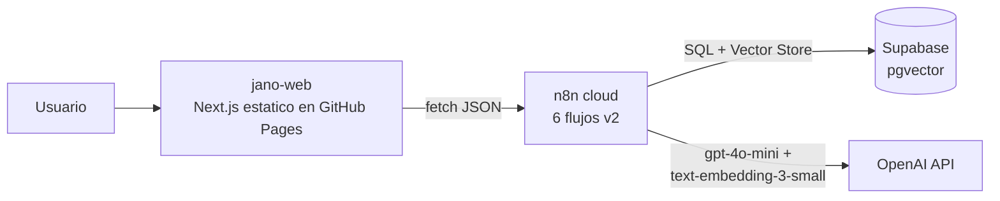
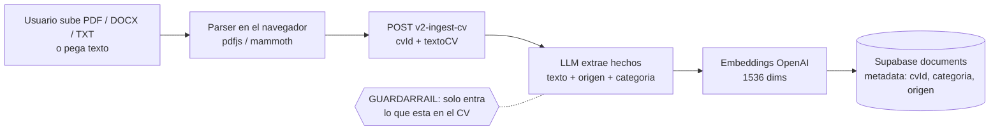
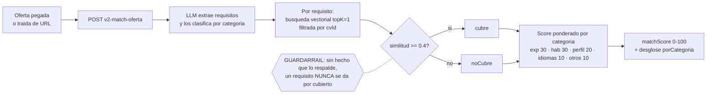
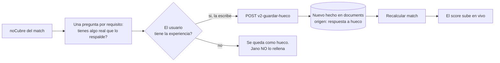
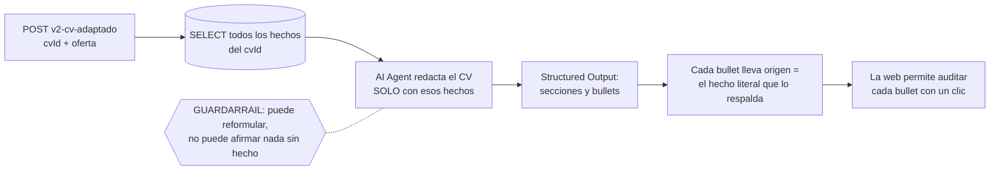
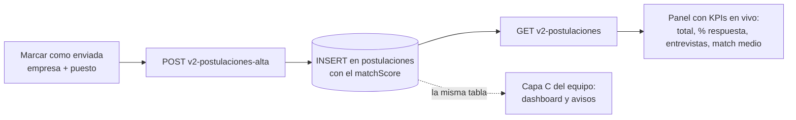

# Arquitectura de Jano 2.0 · diagramas de flujo

Jano adapta un CV a una oferta **sin inventar nada**. La web ([jano-web](https://samtho.github.io/jano-web/)) es 100% estática: todo el motor vive en **flujos de n8n** sobre **Supabase pgvector**. Este documento describe la lógica de cada proceso (los diagramas se renderizan en GitHub automáticamente).

## Vista general

La web no tiene servidor propio: cada acción del usuario llama a un webhook de n8n con CORS abierto. Cada visitante tiene un `cvId` propio (UUID en localStorage), así varios usuarios conviven sin pisarse.

## 1. Ingesta del CV

Notas:
- El archivo **nunca sale del navegador**: solo viaja el texto extraído.
- La ingesta es idempotente por `cvId` (borra los hechos previos de ese CV antes de insertar).

## 2. Match con la oferta

El umbral 0.4 es **matemático** (similitud coseno), no una opinión del modelo: el LLM solo extrae y clasifica, el veredicto cubierto/no cubierto lo da la búsqueda vectorial.

## 3. Ciclo de huecos (la memoria del agente)

Verificado en pruebas reales: un match de 43 subió a 86 tras responder un hueco de experiencia.

## 4. CV adaptado (generativo con cita)

## 5. Tracker (cerrar el ciclo)

Cero doble entrada: el alta es automática y el equipo (capa C) consume la misma tabla.

## Flujos n8n v2 (inventario)

| Flujo | Webhook | Entrada | Salida |
|---|---|---|---|
| v2 Ingesta CV | `POST /webhook/v2-ingest-cv` | `{cvId, textoCV}` | `{ok, guardados}` |
| v2 Match | `POST /webhook/v2-match-oferta` | `{cvId, oferta_texto}` | `{matchScore, porCategoria, cubre, noCubre}` |
| v2 Guardar hueco | `POST /webhook/v2-guardar-hueco` | `{cvId, requisito, respuesta}` | `{ok}` |
| v2 CV adaptado | `POST /webhook/v2-cv-adaptado` | `{cvId, oferta_texto}` | `{secciones[]}` |
| v2 Oferta desde URL | `POST /webhook/v2-oferta-url` | `{url}` | `{oferta_texto}` |
| v2 Postulaciones | `GET /webhook/v2-postulaciones` · `POST /webhook/v2-postulaciones-alta` | `{empresa, puesto, ...}` | lista · `{ok, id}` |

Los flujos v1 del PoC original siguen activos e intactos: v1 y v2 conviven (demo "antes y después").

## Límites conocidos (v2, honestos)

- Sin OCR: un PDF escaneado pide pegar el texto a mano.
- Ofertas por URL: LinkedIn suele bloquear la lectura anónima (fallback: pegar el texto). Portales públicos funcionan.
- Identidad por navegador (UUID), sin login.
- La descarga .docx ATS es de la capa C; la web ofrece imprimir / guardar PDF.
